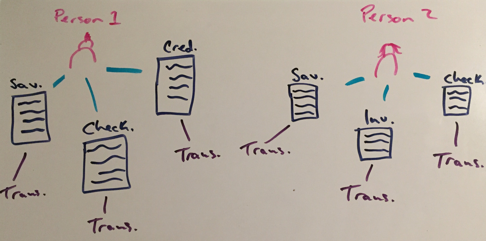

# Current Data Model

Currently, the transaction data is being stored using CSV files.  Below are the requirements for the files:

* The file name must follow the following convention: `1-2020.csv`, the first number being the month and the second being the year.
* The file contents must have a single row for the header, and consistent rows thereafter for the values.

# Data Model Ideas

## Idea 1:

It might be worth it to use a MongoDB Framework for our Database.  The reason being that each user could be a "document", with however many accounts, containing however many transactions...

#### Links:
* [Linux MongoDB Tutorial](https://www.ionos.com/community/hosting/mongodb/installing-and-running-mongodb-on-a-linux-server/)
